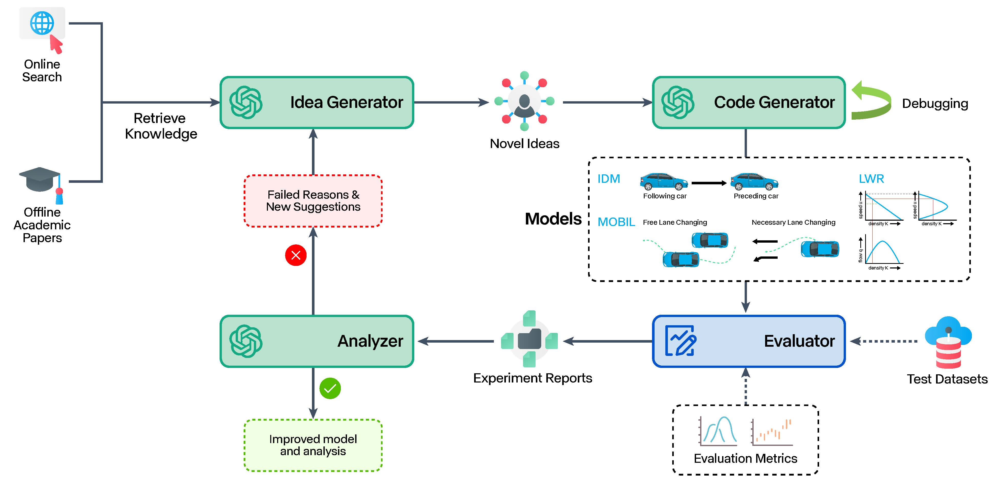
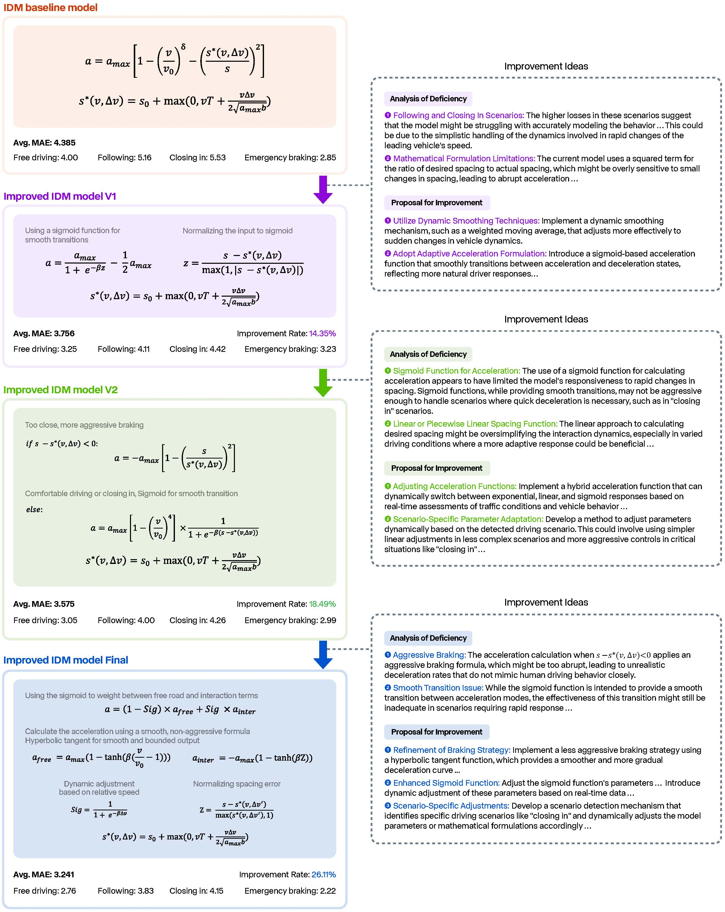
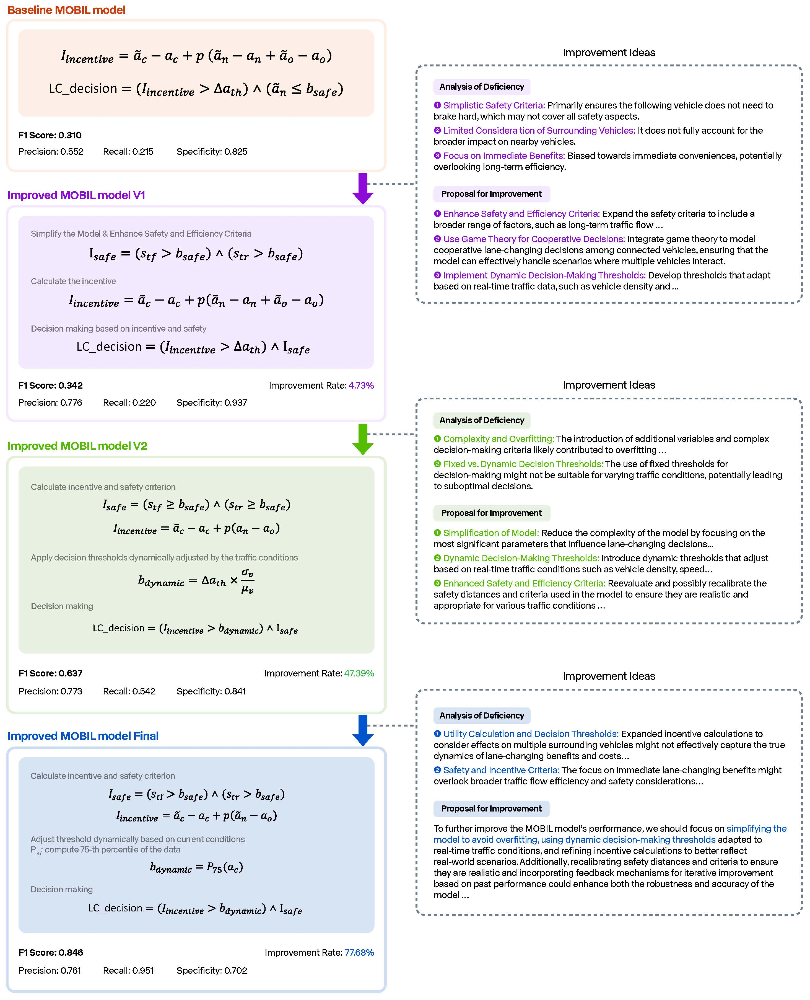
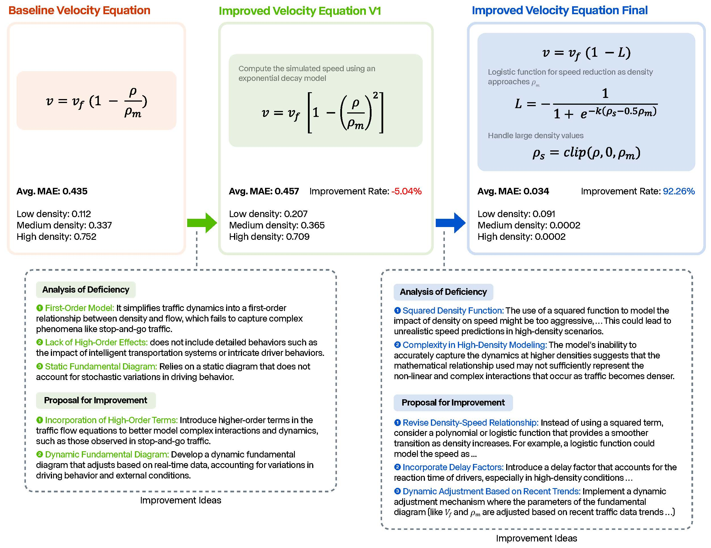

## Automating Traffic Model Enhancement with AI Research Agent

Arxiv: [https://arxiv.org/abs/2409.16876](https://arxiv.org/abs/2409.16876)



### Quick Start

Clone the repository and install the dependencies:

```bash
git clone https://github.com/Guoxs/TR-Agent.git
cd TR-Agent
```

Install the dependencies:

```bash
conda env create -f environment.yml
```

You should add API keys in the `Agents/config.py` file:

```python
configs = {
    ...
    'openai_api_key': '<your_openai_api_key>',
    'tavily_api_key': '<your_tavily_api_key>',
    ...
}
```

You can also modify other configurations in the `Agents/config.py` file.

Run the script for IDM task:

```bash
cd Agents

# Run the script for IDM task
python research_agent.py --task_name IDM
```

### Results

A successful improvement process of the IDM car-following model



A successful improvement process of the MOBIL lane-changing model



A successful improvement process of the velocity equation in the LWR model




### Citation

Please cite our paper if you find this repository useful:

```bibtex
@article{guo2024automating,
  title={Automating Traffic Model Enhancement with AI Research Agent},
  author={Guo, Xusen and Yang, Xinxi and Peng, Mingxing and Lu, Hongliang and Zhu, Meixin and Yang, Hai},
  journal={arXiv preprint arXiv:2409.16876},
  year={2024}
}
```